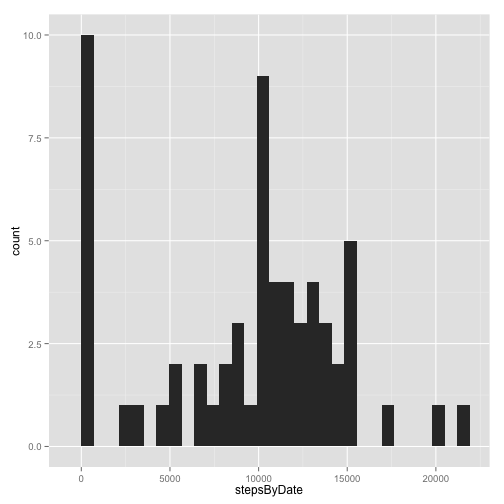
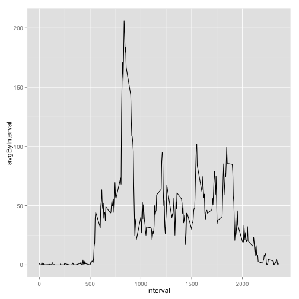
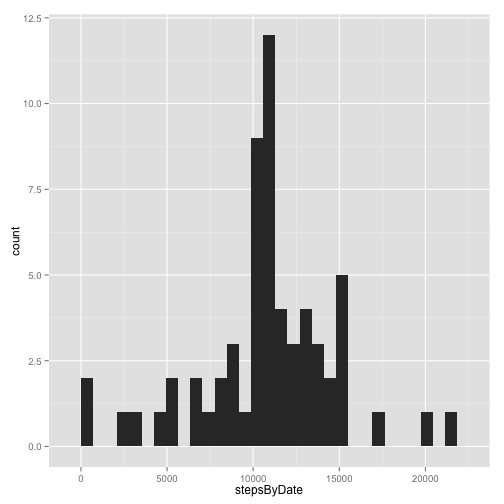

### Data Preparation
The data for this assignment can be downloaded from the course web site:

- Activity monitoring data [https://d396qusza40orc.cloudfront.net/repdata%2Fdata%2Factivity.zip]

Please make sure the extracted activity.csv file is in the current working directory.

###Loading and preprocessing the data:


```r
library(ggplot2)
library(dplyr)

activity <- read.csv(file = "activity.csv", header = TRUE)
```

```
## Warning in file(file, "rt"): 파일 'activity.csv'를 여는데 실패했습니다: No
## such file or directory
```

```
## Error in file(file, "rt"): 커넥션을 열 수 없습니다
```

```r
group_by_date <- group_by(activity, date)
group_by_interval <- group_by(activity, interval)
```

###What is mean total number of steps taken per day?

Calculate the total number of steps taken per day

```r
by_date <- summarise(group_by_date, stepsByDate = sum(steps,na.rm = TRUE))
```

Make a histogram of the total number of steps taken each day

```
## stat_bin: binwidth defaulted to range/30. Use 'binwidth = x' to adjust this.
```

 

Calculate and report the mean and median of the total number of steps taken per day

```r
my_mean <- mean(x = by_date$stepsByDate)
my_median <- median(x = by_date$stepsByDate)
```
The mean value of the total number of steps taken per day is ``9354.2295082`` and the median value  is ``10395``.


###What is the average daily activity pattern?
Make a time series plot (i.e. type = "l") of the 5-minute interval (x-axis) and the average number of steps taken, averaged across all days (y-axis)

```r
by_interval <- summarise(group_by_interval, stepsByInterval = sum(steps, na.rm = TRUE))
avg_by_interval <- summarise(group_by_interval, avgByInterval = mean(x = steps, na.rm = TRUE))
avg_by_interval <- arrange(avg_by_interval, desc(avgByInterval))
qplot(data = avg_by_interval, x = interval, y= avgByInterval, geom = "line")
```

 

Which 5-minute interval, on average across all the days in the dataset, contains the maximum number of steps?

```r
avg_by_interval[1,]
```

```
## Source: local data frame [1 x 2]
## 
##   interval avgByInterval
## 1      835      206.1698
```
Interval ``835`` contains the maximum number of average steps across all the days in the dataset.

###Imputing missing values
Calculate and report the total number of missing values in the dataset (i.e. the total number of rows with NAs)


```r
nrow(activity[is.na(activity$steps),])
```

```
## [1] 2304
```

Devise a strategy for filling in all of the missing values in the dataset. And create a new dataset that is equal to the original dataset but with the missing data filled in.
Replace NA with mean value of steps per interval.

```r
activity_no_missing_data <- activity
tmp_mean <- mean(activity$steps, na.rm = TRUE)
activity_no_missing_data[is.na(activity_no_missing_data),]$steps <- tmp_mean
```

Make a histogram of the total number of steps taken each day

```
## stat_bin: binwidth defaulted to range/30. Use 'binwidth = x' to adjust this.
```

 
Do these values differ from the estimates from the first part of the assignment? What is the impact of imputing missing data on the estimates of the total daily number of steps?

Calculate and report the mean and median total number of steps taken per day

```r
my_mean_no_missing_data <- mean(x = by_date_no_missing_data$stepsByDate)
my_median_no_missing_data <- median(x = by_date_no_missing_data$stepsByDate)

print(my_mean_no_missing_data)
```

```
## [1] 10766.19
```

```r
print(my_median_no_missing_data)
```

```
## [1] 10766.19
```
The mean value of the total number of steps taken per day with imputing NA is ``1.0766189 &times; 10<sup>4</sup>`` (previously ``9354.2295082``) and the median value is ``1.0766189 &times; 10<sup>4</sup>`` (previously ``10395``). 

###Are there differences in activity patterns between weekdays and weekends?

Set locale for date calculation

```r
Sys.setlocale("LC_ALL", 'en_US.UTF-8')
```

```
## [1] "en_US.UTF-8/en_US.UTF-8/en_US.UTF-8/C/en_US.UTF-8/ko_KR.UTF-8"
```


```r
activity_with_pattern <- mutate(activity_no_missing_data, day_type = ifelse(weekdays(as.POSIXct(date), abbreviate = TRUE) %in% c("Sat","Sun"), "Weekend", "Weekday"))
group_by_interval_with_pattern <- group_by(activity_with_pattern, day_type, interval)
by_interval_with_pattern <- summarise(group_by_interval_with_pattern, stepsByInterval = sum(steps))
```

Make a panel plot containing a time series plot (i.e. type = "l") of the 5-minute interval (x-axis) and the average number of steps taken, averaged across all weekday days or weekend days (y-axis).

```r
qplot(x = interval, y = stepsByInterval, data = by_interval_with_pattern, geom="line", facets = (day_type ~ .))
```

 
